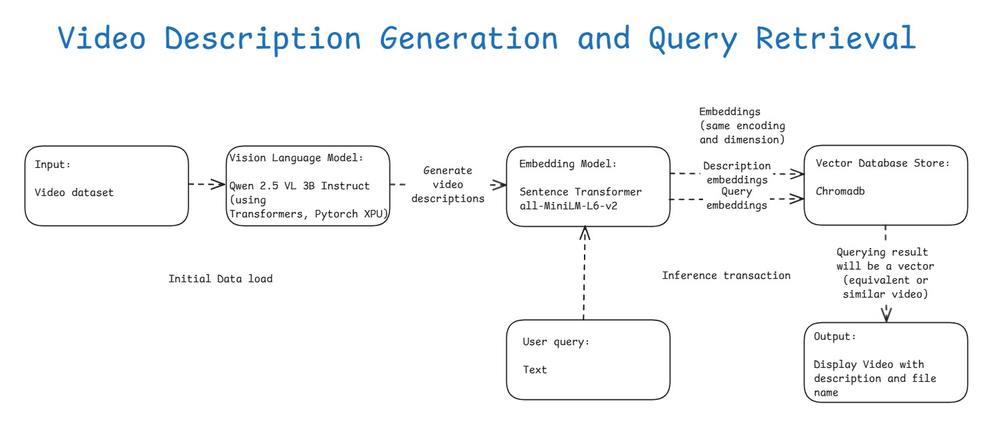
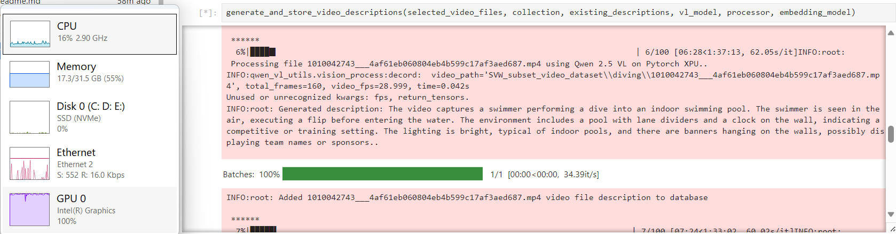
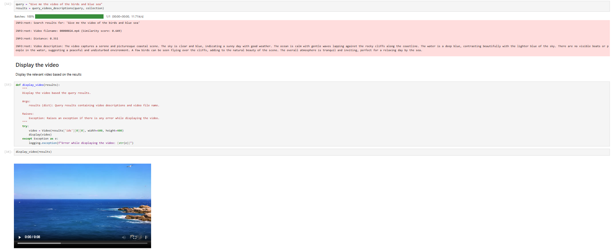

# Video Description Generation and Query Retrieval
## Introduction

This sample demonstrates how to generate video descriptions using the [**Qwen 2.5 Vision-Language model**](https://github.com/QwenLM/Qwen2.5-VL) and store their embeddings in [**ChromaDB**](https://www.trychroma.com/) for efficient semantic search on **Intel® Core™ Ultra Processors**. The Qwen 2.5 Vision-Language model is loaded using the [**PyTorch XPU backend**](https://docs.pytorch.org/docs/stable/notes/get_start_xpu.html) to leverage Intel hardware acceleration.\
For each video, a description is generated and stored as an embedding in ChromaDB. When a user submits a query, cosine similarity search is performed in ChromaDB to retrieve the most relevant video description. The matching video is then displayed inline.\
This sample supports sports-related queries and uses a subset of videos from the [**Sports Videos in the Wild (SVW)**](https://cvlab.cse.msu.edu/project-svw.html) dataset. For more information on the dataset and citation requirements, please refer to the [**Sports Videos in the Wild (SVW) dataset paper**](https://cvlab.cse.msu.edu/project-svw.html#:~:text=SVW%20Download,Bibtex%20%7C%20PDF).

## Table of Contents

1. Workflow
2. Sample Structure
3. Prerequisites
4. Installing Prerequisites and Setting Up the Environment
   - For Windows
   - For Linux
5. Running the Sample and execution output
6. Dataset Citations

## Workflow

- During the initial data load, a subset of videos from the [Sports Videos in the Wild (SVW)](https://cvlab.cse.msu.edu/project-svw.html) dataset is fed into the [Qwen 2.5 Vision-Language model](https://github.com/QwenLM/Qwen2.5-VL).
- Here, the [Qwen2.5-VL-3B-Instruct](https://huggingface.co/Qwen/Qwen2.5-VL-3B-Instruct) model variant is used to process these videos and generate descriptions. The Qwen 2.5 Vision-Language model is loaded using the [PyTorch XPU backend](https://docs.pytorch.org/docs/stable/notes/get_start_xpu.html) to leverage Intel hardware acceleration.
- Next, the generated video descriptions are converted into embeddings using [Sentence Transformers](https://sbert.net/), with the [all-MiniLM-L6-v2 model](https://huggingface.co/sentence-transformers/all-MiniLM-L6-v2).
- These embeddings, along with the descriptions and video metadata, are stored in a persistent local [ChromaDB](https://www.trychroma.com/) collection. This is a one-time operation; since ChromaDB is local and persistent, it does not need to be repeated unless new videos are added.
- When a user submits a query, the text is similarly encoded into an embedding, which is then used to perform a semantic search (via cosine similarity) over the ChromaDB collection.
- The final result will be the most relevant video description and its associated video file name, and the video is displayed directly in the notebook.



## Sample Structure

    .
    ├── Video-Description-Generation-Query-Retrieval/                          # Sample folder
    │   ├── assets/                                                            # assets folder which contains the images
    │   │   ├── Generating_video_descriptions_using_Pytorch_XPU.png            # Output screenshot image 1
    │   │   ├── Video_description_generation_and_query_retrieval_workflow.jpg  # Workflow image
    │   │   └── Video_display.png                                              # Output screenshot image 2
    │   ├── Readme.md                                                          # Readme file which contains all the details and instructions about the sample
    │   ├── SVW_subset_video_dataset.zip                                       # ZIP file which contains subset videos of the Sport videos in the wild
    │   ├── Video_Description_Generation_Query_Retrieval.ipynb                 # Notebook file to excute the sample
    │   ├── pyproject.toml                                                     # Requirements for the sample
    │   └── uv.lock                                                            # File which captures the packages installed for the sample

## Prerequisites

|    Component   |   Recommended   |
|   ------   |   ------   |
|   Operating System(OS)   |   Windows 11 or later/ Ubuntu 20.04 or later   |
|   Random-access memory(RAM)   |   32 GB   |
|   Hardware   |   Intel® Core™ Ultra Processors, Intel Arc™ Graphics, Intel Graphics, Intel® Xeon® Processor, Intel® Data Center GPU Max Series   |


## Installing Prerequisites and Setting Up the Environment

### For Windows:
To install any software using commands, Open the Command Prompt as an administrator by right-clicking the terminal icon and selecting `Run as administrator`.
1. **GPU Drivers installation**\
   Download and install the Intel® Graphics Driver for Intel® Arc™ B-Series, A-Series, Intel® Iris® Xe Graphics, and Intel® Core™ Ultra Processors with Intel® Arc™ Graphics from [here](https://www.intel.com/content/www/us/en/download/785597/intel-arc-iris-xe-graphics-windows.html)\
   **IMPORTANT:** Reboot the system after the installation.

2. **Git for Windows**\
   Download and install Git from [here](https://git-scm.com/downloads/win)

3. **uv for Windows**\
   Steps to install `uv` in the Command Prompt are as follows. Please refer to the [documentation](https://docs.astral.sh/uv/getting-started/installation/) for more information.
   ```
   powershell -ExecutionPolicy ByPass -c "irm https://astral.sh/uv/install.ps1 | iex"
   ```
   **NOTE:** Close and reopen the Command Prompt to recognize uv.
   
### For Linux:
To install any software using commands, Open a new terminal window by right-clicking the terminal and selecting `New Window`.
1. **GPU Drivers installation**\
   Download and install the GPU drivers from [here](https://dgpu-docs.intel.com/driver/client/overview.html)

2. **Dependencies on Linux**\
   Install Curl, Wget, Git using the following commands:
   - For Debian/Ubuntu-based systems:
   ```
   sudo apt update && sudo apt -y install curl wget git
   ```
   - For RHEL/CentOS-based systems:
   ```
   sudo dnf update && sudo dnf -y install curl wget git
   ```

3. **uv for Linux**\
   Steps to install uv are as follows. Please refer to the [documentation](https://docs.astral.sh/uv/getting-started/installation/) for more information.
   - If you want to use curl to download the script and execute it with sh:
   ```
   curl -LsSf https://astral.sh/uv/install.sh | sh
   ```
   - If you want to use wget to download the script and execute it with sh:
   ```
   wget -qO- https://astral.sh/uv/install.sh | sh
   ```

## Running the Sample and execution output
   
1. In the Command Prompt/terminal, navigate to `Video-Description-Generation-Query-Retrieval` folder after cloning the sample:
   ```
   cd <path/to/Video-Description-Generation-Query-Retrieval/folder>
   ```
   
2. Launch Jupyter Lab and Run the notebook:\
   Open the [Video Description Generation Query Retrieval](./Video_Description_Generation_Query_Retrieval.ipynb) notebook in the Jupyter Lab.
   - In the Jupyter Lab go to the kernel menu in the top-right corner of the notebook interface and choose default kernel i.e. `Python 3 (ipykernel)` from the available kernels list and run the code cells one by one in the notebook.
   ```
   uv run jupyter lab
   ```
   - If you are running the sample in the Intel Tiber AI Cloud(ITAC), follow these steps in a new terminal session. Create and select the `uv_env` Jupyter kernel to get access to required python packages in the notebook.
   ```
   uv sync
   uv run python -m ipykernel install --user --name=uv_env --display-name="uv_env"
   ```

   **NOTE:** Run the below command if you face any dependency issues:
   ```
   uv clean
   ```

3. GPU utilization can be seen in the Task Manager while generating video descriptions for videos which are processing on Intel XPUs.
   

4. Relevant video will be displayed based on user query.
   


## Dataset Citations

If you use SVW dataset, please refer to this paper in your publications:

### Publications:
- [**Sports Videos in the Wild (SVW): A Video Dataset for Sports Analysis**](https://cvlab.cse.msu.edu/project-svw.html)\
[**Seyed Morteza Safdarnejad**](https://cvlab.cse.msu.edu/author/seyed-morteza-safdarnejad.html), [**Xiaoming Liu**](https://cvlab.cse.msu.edu/author/xiaoming-liu.html), [**Lalita Udpa**](https://cvlab.cse.msu.edu/author/lalita-udpa.html), [**Brooks Andrus**](https://cvlab.cse.msu.edu/author/brooks-andrus.html), [**John Wood**](https://cvlab.cse.msu.edu/author/john-wood.html), [**Dean Craven**](https://cvlab.cse.msu.edu/author/dean-craven.html)\
Proc. International Conference on Automatic Face and Gesture Recognition (FG 2015), Ljubljana, Slovenia, May. 2015 (Acceptance rate 84/221 = 38%)\
[**Bibtex**](https://cvlab.cse.msu.edu/project-svw.html#bibtex-sports-videos-in-the-wild-svw-a-video-dataset-for-sports-analysis) | [**PDF**](https://cvlab.cse.msu.edu/pdfs/Morteza_FG2015.pdf)
